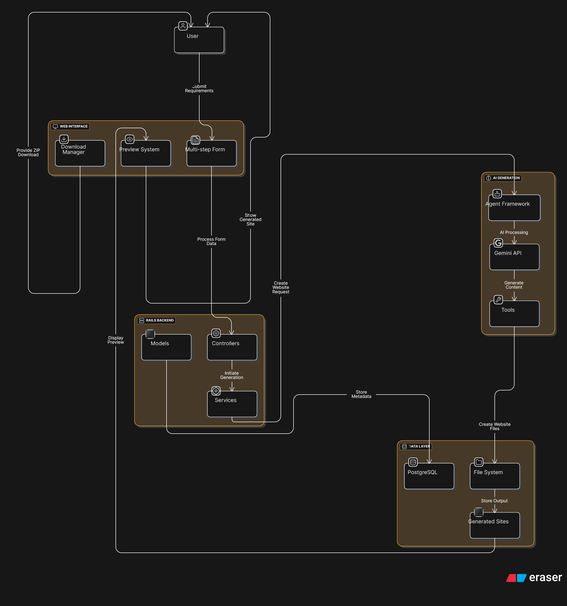
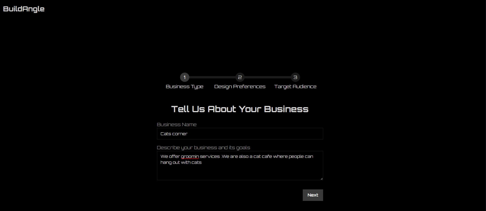
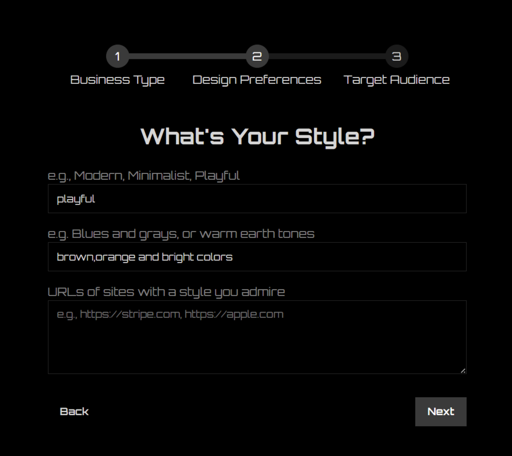
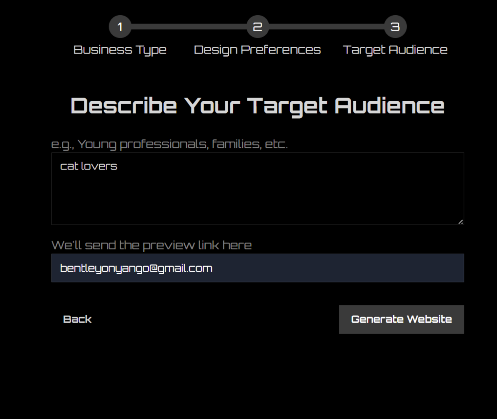
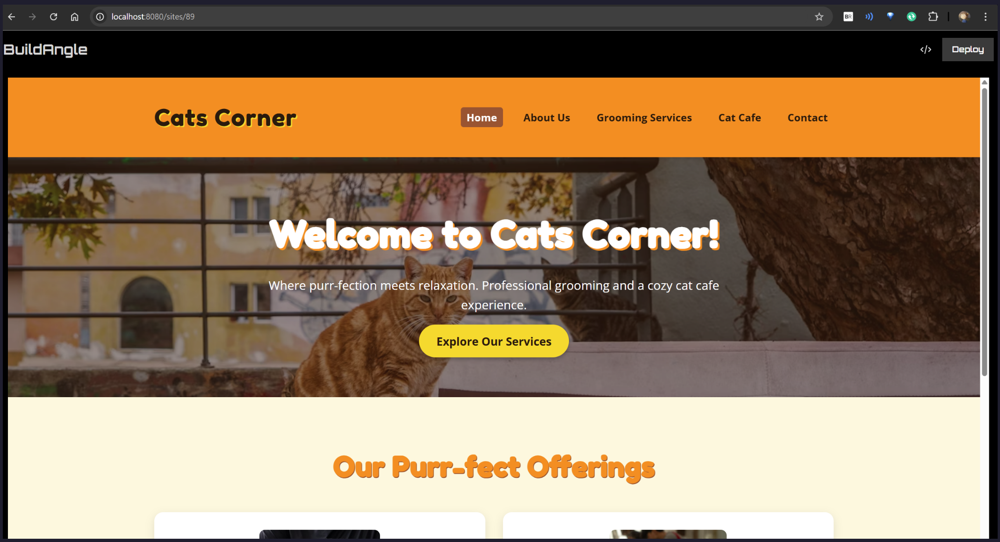
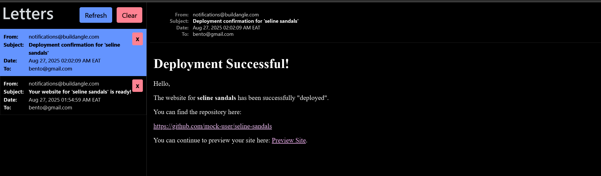

# Build Angle 🏗️

An AI-powered static website generator that creates professional, multi-page websites based on user requirements. Built with Ruby on Rails and powered by Google's Gemini AI model.


## 🚀 Quick Start

### Prerequisites

- Docker and Docker Compose
- Ruby 3.4.2 (if running locally)
- PostgreSQL 17.6+ (if running locally)
- Git

### How to Setup

1. **Clone the repository**

   ```bash
   git clone https://github.com/BentleyOph/build_angle.git
   cd build_angle
   ```

2. **Set up environment variables**

   ```bash
   cp env.example .env
   # Edit .env and add your Gemini API key and Unsplash Key.
   # (Optional)Add OpenAI key for imagetool
   ```

3. **Start the database**

   ```bash
   docker-compose up -d db
   ```

4. **Build and run the application**

   ```bash
   # Install dependencies
   bundle install
   
   # Setup database
   rails db:create db:migrate db:seed
   
   # Start the server
   bin/dev
   ```

## 🔧 Configuration

### Required Environment Variables

| Variable | Description | Required |
|----------|-------------|----------|
| `GEMINI_API_KEY` | Google Gemini API key for AI generation | Yes |
| `UNSPLASH_ACCESS_KEY` | Unsplash API key for images  | Yes |

### Getting Your Gemini API Key

1. Visit [Google AI Studio](https://aistudio.google.com/app/apikey)
2. Create a new API key
3. Add it to your `.env` file as `GEMINI_API_KEY=your_key_here`

**Note**: The free tier provides 5 - 15 requests per minute with a daily limit, which is sufficient for development and small-scale usage.

## 🏛️ Architecture Overview

### High-Level Architecture



### Component Overview

#### 1. **Web Interface Layer**

- Multi-step form using the Wicked gem
- Progressive collection of user requirements
- Real-time preview of generated sites
- Download functionality for completed websites

#### 2. **Application Layer**

- **Controllers**: Handle HTTP requests and orchestrate services
- **Models**: `WebsiteRequest` and `GeneratedPage` for data persistence
- **Services**: `AiWebsiteGenerator` orchestrates the AI generation process

#### 3. **AI Generation Layer**

- **Agent Framework**: Custom AI agents using the `ai-agents` gem
- **Tools**: File creation, image generation, and content management
- **Model**: Gemini 2.5 Flash for fast, cost-effective generation

#### 4. **Storage Layer**

- PostgreSQL for application data
- File system for generated static sites
- Public directory for serving generated websites

## 🤖 AI Generation Approach

### Agent-Based Architecture

Build Angle uses an agent-based approach powered by the `ai-agents` framework, providing several advantages:

```ruby
# Simplified agent creation
@runner = Agents::Runner.with_agents(CreatorAgent.create_unsplash)
```

#### Why AI-Agents Framework?

1. **Simplicity**: Significantly faster development compared to using `ruby-llms` directly
2. **Tool Integration**: Built-in support for custom tools and function calling
3. **State Management**: Automatic conversation and context management
4. **Extensibility**: Easy to add new capabilities and tools

#### Agent Tools

1. **FileTool**: Creates HTML, CSS, and JavaScript files
2. **ImageTool**: Generates custom images using AI
3. **UnsplashImage**: Fetches professional stock images from Unsplash

### Generation Process

1. **Requirements Collection**: Multi-step form gathers user preferences



2. **Context Building**: Agent receives structured prompt with all requirements
3. **Site Generation**: Agent creates 5-page static website:
   - `index.html` - Homepage
   - `about.html` - About page
   - `services.html` - Services/Products
   - `contact.html` - Contact information
   - Custom page based on business type

   
   <em>based on the requirements collected above for a site the generated one is as shown below</em>


4. **Asset Creation**: CSS styling and JavaScript functionality
5. **Image Integration**: AI-generated or Unsplash images

### Example Agent Prompt

```ruby
initial_prompt = <<~PROMPT
  Please generate a new website with the following details.
  The root directory for all files MUST be: '#{directory_path}'

  **User Requirements:**
  - **Business Name:** #{@website_request.business_name}
  - **Business Type & Goals:** #{@website_request.business_type}
  - **Design Preferences:** #{@website_request.design_preferences}
  - **Style Preferences:** #{@website_request.style_preferences}
  - **Color Preferences:** #{@website_request.color_preferences}
  - **Target Audience:** #{@website_request.target_audience}
PROMPT
```

## 📤 Website Export & Download System

### How Website Export Works

Build Angle generates complete static websites that can be exported as ZIP files for easy deployment to any hosting platform:

#### **Generation Process:**

1. **AI Website Generator**: Creates complete 5-page static website using Gemini AI
   - `index.html` - Homepage
   - `about.html` - About page  
   - `services.html` - Services/Products
   - `contact.html` - Contact information
   - Custom page based on business type
   - Complete CSS styling and JavaScript functionality
   - AI-generated or Unsplash images

2. **File Storage**: Generated websites are stored in the file system at:

   ```bash
   public/generated_sites/user_<id>-<business-name>-<timestamp>/
   ```

#### **Download Functionality:**

- **ZIP Packaging**: Complete website packaged with all assets
- **Instant Download**: Available immediately after generation
- **Ready for Deployment**: Works with any hosting platform (GitHub Pages, Netlify, Vercel, etc.)
- **Automatic Cleanup**: Temporary ZIP files are cleaned up after 60 seconds

*[Screenshot placeholder: ZIP download dialog showing generated website package]*

## 📧 Email Notification System

### How Email Notifications Work

To view emails visit [http://localhost:3000/letter_opener]

Build Angle uses Rails ActionMailer with background job processing to send email confirmations:

#### **Notification Types:**

- **Generation Complete Email**
  - Sent when AI finishes creating the website
  - Includes preview link to view the generated site
  - Professional email template with branded styling


- **Deployment Complete Email**  
  - Sent after mock "deployment" to GitHub/Netlify
  - Includes mock repository URL for demonstration
  - Confirms deployment success with live site links


- **Letter Opener**: Emails open automatically in browser during development
- **Background Processing**: Uses `deliver_later` for async email sending
- **Email Templates**: Professional HTML and text versions available

### Mock Deployment System

**Important Note**: Build Angle currently uses **mock deployment** for demonstration purposes:

#### **How Mock Deployment Works:**

1. User clicks "Deploy" button after generation
2. System updates database with mock data:

   ```ruby
   @website_request.update(
     deployed_at: Time.current,
     repo_url: "https://github.com/mock-user/#{business_name.parameterize}"
   )
   ```

3. Sends deployment confirmation email with mock GitHub URL
4. No actual deployment to external services occurs

## 🏗️ Key Architectural Decisions

### 1. **AI Model Selection: Gemini 2.5 Flash**

**Decision**: Google Gemini 2.5 Flash over OpenAI GPT models

**Rationale**:

- **Cost Efficiency**: Free tier with 10 RPM (requests per minute)
- **Performance**: Fast generation times suitable for web applications
- **Capability**: Sufficient for HTML/CSS/JS generation tasks
- **Rate Limits**: 15 RPM is appropriate for the expected usage patterns

**Trade-offs**:

- Slightly lower capability than GPT-5 or Gemini 2.5 pro for complex reasoning and better output
- Dependency on Google's infrastructure
- Rate limiting requires careful request management

### 2. **Agent Framework: ai-agents vs ruby-llms**

**Decision**: `ai-agents` gem over direct `ruby-llms` integration

**Rationale**:

- **Development Speed**: Pre-built abstractions reduce implementation time
- **Tool Integration**: Built-in function calling and tool management
- **Maintenance**: Less boilerplate code to maintain

**Implementation**:

```ruby
# Simple agent creation with tools
agent = Agents::Agent.new(
  name: "Creator Agent",
  instructions: agent_instructions,
  model: "gemini-2.5-flash",
  tools: [FileTool.new, UnsplashImage.new]
)
```

### 3. **Output Format: Static Site Generator (SSG)**

**Decision**: Generate static HTML/CSS/JS websites instead of dynamic applications

**Rationale**:

- **Simplicity**: No complex build processes or development environments
- **Deployment**: Easy to host anywhere (GitHub Pages, Netlify, Vercel)
- **Performance**: Fast loading times with no server dependencies
- **Maintenance**: No ongoing server maintenance required
- **AI Limitations**: Simpler for AI to generate compared to complex frameworks

**Alternative Considered**: Vite/React applications

- **Rejected because**:
  - Requires complex build tooling setup
  - Need for package management and dependencies
  - Environmental configuration complexity
  - Higher learning curve for generated code modification

### 4. **Image Generation: Unsplash vs OpenAI**

**Decision**: Unsplash API as primary image source with OpenAI as optional fallback

**Rationale**:

- **Cost Efficiency**: Unsplash provides free, high-quality stock photos
- **Speed**: Instant image retrieval vs. AI generation wait times
- **Reliability**: No rate limits or generation failures common with AI image APIs
- **Professional Quality**: Curated, professional photography suitable for business websites
- **Flexibility**: Images are likely to change during development and testing phases

**Implementation**:

Build Angle implements a dual-tool approach for image generation:

```ruby
# Primary: UnsplashImage tool for fast, free stock photos
class UnsplashImage < Agents::Tool
  description "Searches Unsplash and returns a direct image URL"
  
  def perform(_tool_context, query:, orientation: nil, size: nil)
    search_resp = @api.search_photos(query: query, orientation: orientation)
    # Returns professional stock photos instantly
  end
end

# Optional: ImageTool for custom AI-generated images
class ImageTool < Agents::Tool
  description "Generates custom images using OpenAI's Images API"
  
  def perform(tool_context, prompt:, size: "1024x1024")
    # Requires OPENAI_API_KEY environment variable
    # Used for unique, custom imagery when stock photos aren't suitable
  end
end
```

**Unsplash Advantages for MVP/Testing**:

- **Zero Cost**: Free tier supports unlimited requests for development
- **Immediate Results**: No generation time or processing delays
- **Consistent Quality**: Professional photography with proper licensing
- **Search Flexibility**: Semantic search with orientation and size options
- **Rapid Iteration**: Perfect for mockups where images frequently change

**OpenAI Image Generation (Optional)**:

- **Custom Content**: Generate unique images that don't exist in stock libraries
- **Brand Specific**: Create images that match exact brand requirements  
- **Creative Control**: Generate illustrations, logos, or specific compositions
- **Cost Consideration**: $0.040 per 1024×1024 image generation

**Why This Hybrid Approach Works**:

During development and testing phases, websites undergo frequent changes, making expensive AI-generated images impractical. Unsplash provides the perfect solution for rapid prototyping with professional-quality imagery. Once the design is finalized, specific images can be replaced with custom AI-generated content if needed.

```ruby
# Agent can choose appropriate tool based on requirements
@runner = Agents::Runner.with_agents(
  CreatorAgent.create_unsplash  # Default: Fast, free Unsplash images
  # CreatorAgent.create_openai  # Optional: Custom AI generation
)
```

### 5. **Database Strategy**

**Decision**: Minimal database usage with file system storage

**Rationale**:

- **Models**: Only `WebsiteRequest` and `GeneratedPage` for metadata
- **Storage**: Generated sites stored in file system for easy serving
- **Scalability**: Simple to backup and deploy generated sites
- **Performance**: Direct file serving without database queries

### 6. **Multi-Step Form with Wicked**

**Decision**: Progressive disclosure of form fields using Wicked gem

**Rationale**:

- **User Experience**: Reduces cognitive load and form abandonment
- **Data Quality**: Better completion rates for comprehensive requirements
- **Flexibility**: Easy to modify and extend the collection process

## 📦 Dependencies

### Core Dependencies

- **Rails 8.0.2+**: Web framework
- **PostgreSQL**: Primary database
- **ai-agents**: AI agent framework
- **wicked**: Multi-step forms
- **sidekiq**: Background job processing

### Development Dependencies

- **tailwindcss-rails**: CSS framework
- **stimulus-rails**: JavaScript framework
- **turbo-rails**: SPA-like navigation
- **letter_opener_web**: Email preview in development

---

Built using Ruby on Rails and AI
